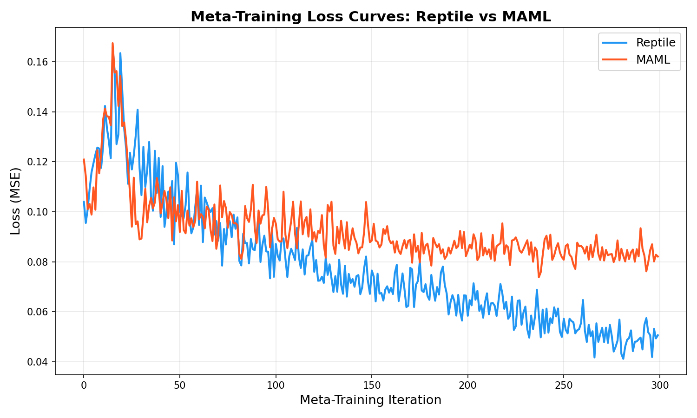
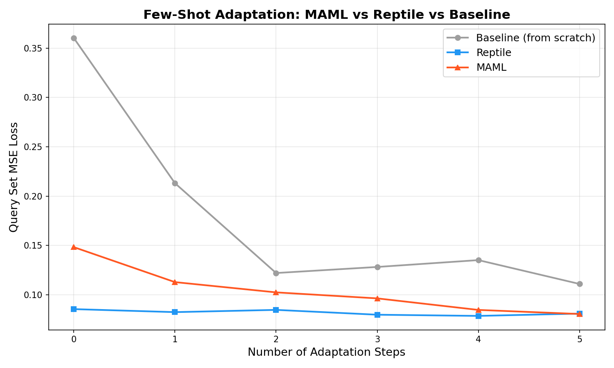

# Meta-Learning for Wireless Localization

## What Did We Build?
We built a **3D indoor wireless localization** system using meta-learning. The model predicts a user's (x, y, z) position from Received Signal Strength (RSS) measurements of 4 Wi-Fi Access Points. We implemented **both MAML (Model-Agnostic Meta-Learning) and Reptile** so the model can adapt to brand-new room environments using only 10 labelled examples. This qualifies for the **Bonus (+10 marks)**.

## How to Set It Up

```bash
git clone https://github.com/your-username/your-repo.git
cd your-repo/end_term
pip install -r requirements.txt
```

## How to Generate Data

```bash
python generate_data.py
```

This script creates **100 training tasks** and **20 test tasks**. Each task simulates a unique indoor 3D room (100m × 100m × 100m) with:
- 4 randomly placed Access Points
- Realistic 2.4 GHz Log-Distance Path Loss model (PLE: 2.0–4.0, Tx Power: 15–20 dBm, Shadow Fading: 4 dB std)
- 10 support samples + 50 query samples per task
- Data is saved as `data/train_data.npz` and `data/test_data.npz`

## How to Train

```bash
python train.py
```

This trains three models:
- **Baseline**: Fresh network trained from scratch (200 steps per task, Adam, lr=0.01)
- **Reptile**: 500 outer iterations, 5 inner steps, inner lr=0.02, outer lr=0.001
- **MAML (FOMAML)**: 500 outer iterations, 5 inner steps, inner lr=0.02, outer lr=0.001

All models use a 3-layer network with 64 neurons per layer. Trained weights are saved to `models/`.

## How to Test

```bash
python test.py
```

This evaluates all 3 models on 20 unseen test rooms. For each test task, the meta-learned models adapt using 5 gradient steps on the support set, then the query set MSE is measured. Two plots are saved to `results/`.

## Results

| Method | 5-shot MSE | 10-shot MSE | 20-shot MSE |
| :--- | :---: | :---: | :---: |
| Baseline (from scratch) | 0.1518 | 0.1241 | 0.1219 |
| **MAML** | **0.0962** | **0.0805** | **0.0780** |
| **Reptile** | **0.1027** | **0.0809** | **0.0793** |

Both meta-learning methods significantly outperform the baseline. MAML and Reptile achieve lower errors faster, with MAML showing slightly better precision in the 20-shot scenario. Both methods convincingly show the advantage of meta-learning for fast adaptation in wireless environments.

### Plot 1 — Training Loss Curve


### Plot 2 — MAML vs Reptile vs Baseline (Bonus)

